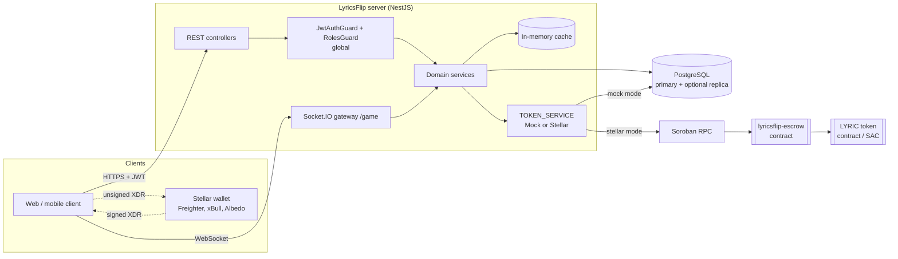
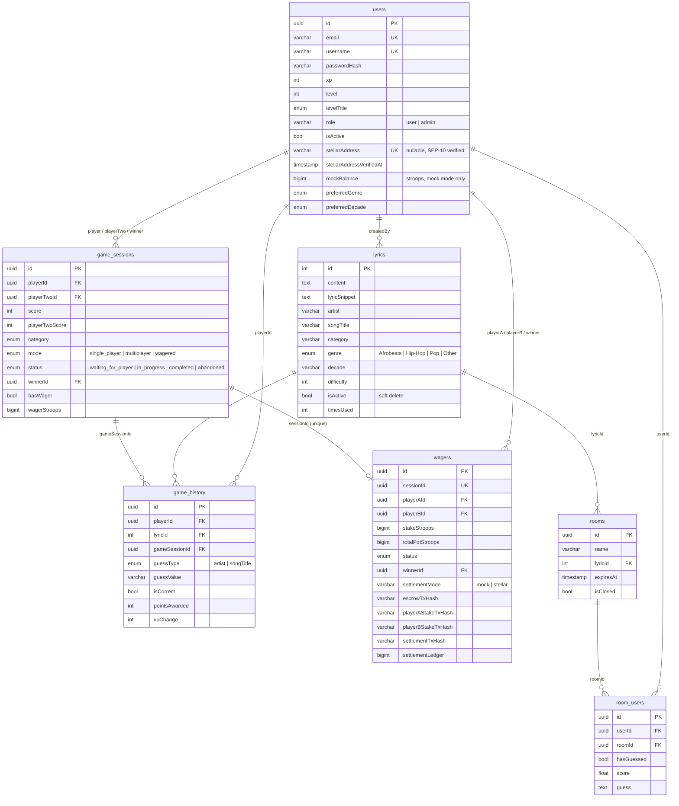
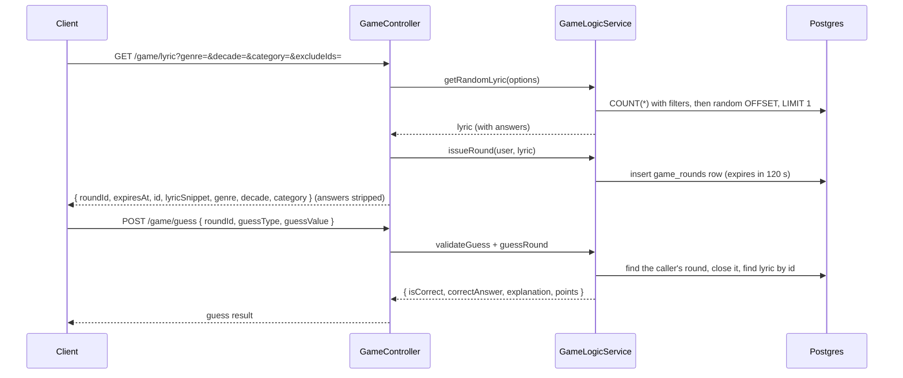
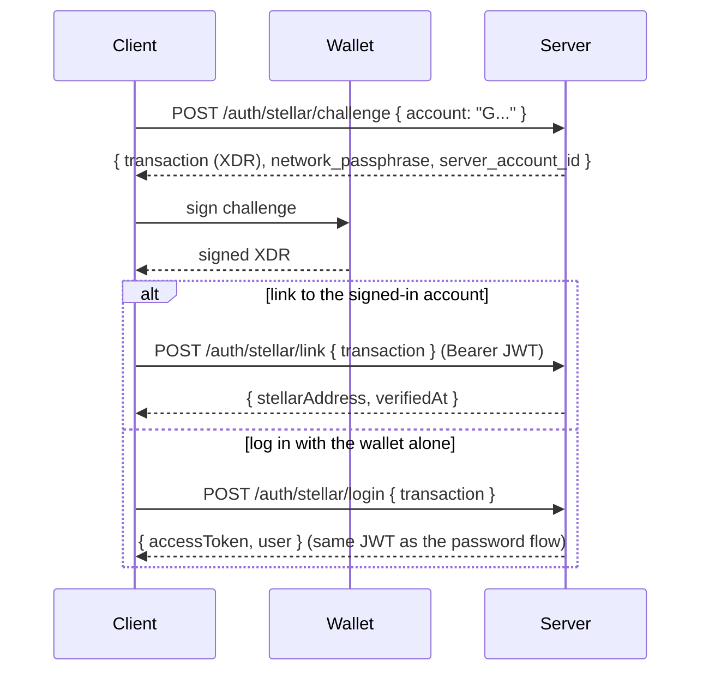
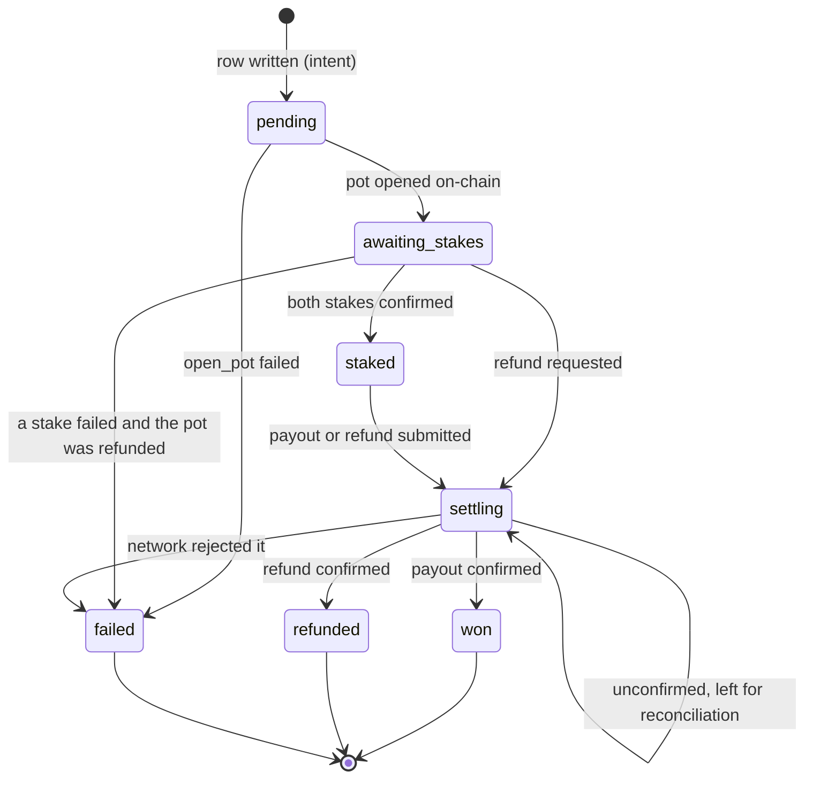
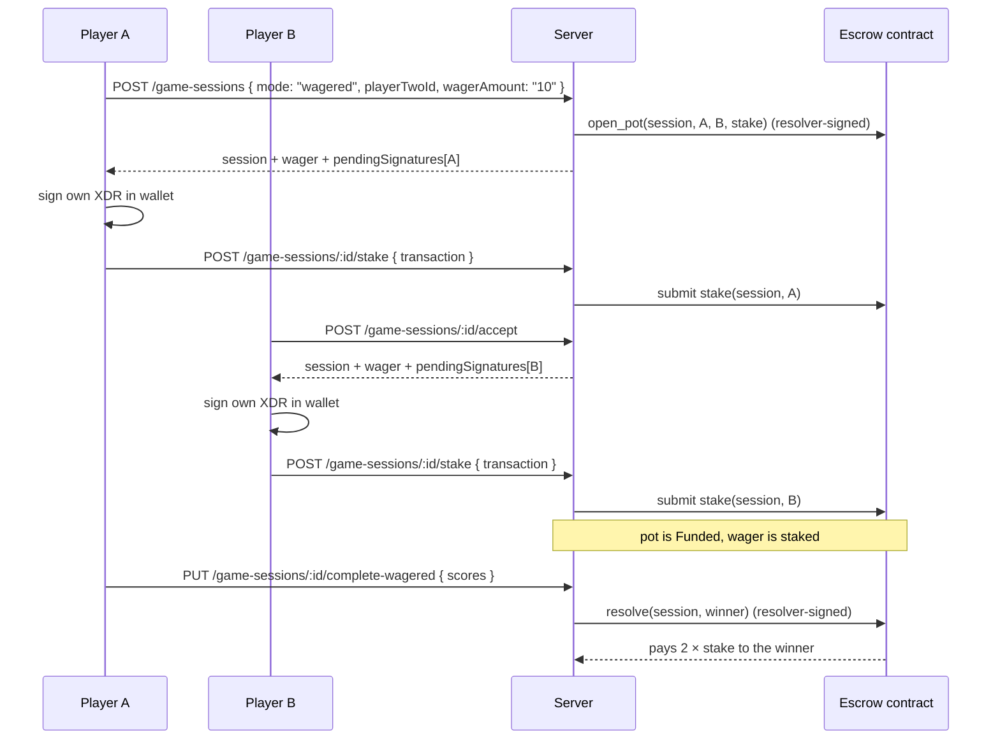

# LyricsFlip: Server

LyricsFlip is a lyrics-guessing game. A player sees a short snippet of a song and has to name the **artist** or the **song title**. Players can play alone, in shared rooms, or head-to-head against another player. A head-to-head match can carry a **wager**: both players put up the same stake, and the winner takes the pot.

This repository is the backend. It is a [NestJS](https://nestjs.com) 11 application with a PostgreSQL database (through TypeORM), a Socket.IO gateway, and a Rust smart contract on [Stellar Soroban](https://developers.stellar.org/docs/build/smart-contracts/overview) that holds wager stakes in escrow, so the server never has custody of players' funds.

> **Project status: active development.** The architecture, authentication, and the whole Stellar settlement layer are in place and well tested. Several gameplay pieces are not yet connected: XP is not awarded, guesses are not written to history, and the WebSocket gateway is not registered. There are also some known authorization gaps. See [Current limitations](#current-limitations) and the full backlog in [`ISSUES.md`](ISSUES.md) before deploying anywhere that handles real value.

---

## Contents

- [What the game is](#what-the-game-is)
- [Tech stack](#tech-stack)
- [Architecture](#architecture)
  - [Modules](#modules)
  - [Request lifecycle](#request-lifecycle)
  - [Data model](#data-model)
- [How the game works](#how-the-game-works)
  - [Lyrics](#lyrics)
  - [Solo play](#solo-play)
  - [Rooms](#rooms)
  - [Head-to-head sessions](#head-to-head-sessions)
  - [Scoring](#scoring)
  - [XP and levels](#xp-and-levels)
  - [History, stats, and leaderboards](#history-stats-and-leaderboards)
  - [Notifications](#notifications)
- [Authentication](#authentication)
  - [Email and password](#email-and-password)
  - [Stellar wallets (SEP-10)](#stellar-wallets-sep-10)
  - [Guards and roles](#guards-and-roles)
- [Wagers and settlement](#wagers-and-settlement)
  - [Amounts](#amounts)
  - [Settlement mode and custody mode](#settlement-mode-and-custody-mode)
  - [The wager lifecycle](#the-wager-lifecycle)
  - [The non-custodial handshake](#the-non-custodial-handshake)
  - [Why no network call runs inside a database transaction](#why-no-network-call-runs-inside-a-database-transaction)
  - [Reconciliation](#reconciliation)
- [The escrow contract](#the-escrow-contract)
- [Getting started](#getting-started)
- [Configuration reference](#configuration-reference)
- [API reference](#api-reference)
- [WebSocket API](#websocket-api)
- [Caching](#caching)
- [Logging and errors](#logging-and-errors)
- [Testing](#testing)
- [Project layout](#project-layout)
- [Current limitations](#current-limitations)
- [Contributing](#contributing)
- [Further documentation](#further-documentation)

---

## What the game is

A round works like this:

1. The server picks a lyric and sends the player **only the snippet**, plus its genre, decade, and category. The artist and title stay hidden.
2. The player guesses the artist or the song title.
3. The server compares the guess with the stored answer, ignoring case and punctuation. It accepts an exact match or a reasonable partial match, awards points, and reveals the correct answer.

On top of that basic round there are three ways to play:

| Mode                   | Players         | What happens                                                                                                              |
| ---------------------- | --------------- | ------------------------------------------------------------------------------------------------------------------------- |
| **Solo**               | 1               | Request a lyric and guess it, over HTTP (and, once it is registered, over WebSocket).                                    |
| **Rooms**              | Many            | A room holds one lyric for 24 hours. Everyone who joins guesses the same snippet and is scored against it.                |
| **Head-to-head**       | 2               | A `GameSession` between two users. It can be a plain multiplayer match or a **wagered** one.                              |

Wagered matches settle in one of two ways, chosen at deploy time. In **mock** mode, balances are rows in Postgres. In **stellar** mode, the stakes are real tokens held by a Soroban escrow contract.

## Tech stack

| Concern             | Choice                                                                          |
| ------------------- | ------------------------------------------------------------------------------- |
| Runtime / framework | Node.js 20+, NestJS 11, TypeScript 5                                            |
| Database            | PostgreSQL 14+, TypeORM 0.3 (migrations, with optional read-replica splitting)  |
| Auth                | Passport JWT, bcrypt, Stellar SEP-10 web authentication                         |
| Real-time           | `@nestjs/websockets` + Socket.IO                                                |
| Caching             | `@nestjs/cache-manager` (in-memory store)                                       |
| Events              | `@nestjs/event-emitter`                                                         |
| Blockchain          | `@stellar/stellar-sdk` 17 (Soroban RPC), escrow contract in Rust with `soroban-sdk` 22 |
| Validation / docs   | `class-validator`, `class-transformer`, Swagger (`@nestjs/swagger`)             |
| Tests               | Jest + ts-jest (unit), Supertest (e2e), `cargo test` (contract)                 |

## Architecture

The backend is a single NestJS application. The escrow contract is deployed separately and the backend talks to it over Soroban JSON-RPC.



### Modules

`JwtAuthGuard` and `RolesGuard` are registered globally as `APP_GUARD`. This means **every route needs a bearer token unless it is marked `@Public()`**. Admin routes also carry `@Roles(Role.Admin)`.

| Module                | Path                  | Responsibility                                                                                          |
| --------------------- | --------------------- | ------------------------------------------------------------------------------------------------------- |
| `AuthModule`          | `src/auth`            | Signup and login, JWT issuance, the `@Public`/`@Roles`/`@GetUser` decorators, and SEP-10 wallet authentication and linking |
| `UsersModule`         | `src/users`           | User entity, profile, music preferences, leaderboard                                                    |
| `LyricsModule`        | `src/lyrics`          | Lyric CRUD (admin), filtered and random lookups, and the cache layer over them                          |
| `GameModule`          | `src/game`            | Solo play: serve a snippet, check a guess, lyric stats (HTTP and a Socket.IO gateway)                   |
| `GameSessionsModule`  | `src/game-sessions`   | Head-to-head sessions, wagered session creation, stake confirmation, wagered completion                 |
| `GameHistoryModule`   | `src/game-history`    | Per-guess records and aggregate player stats                                                            |
| `RoomsModule`         | `src/rooms`           | Shared-lyric rooms with expiry and one guess per player                                                 |
| `TokensModule`        | `src/tokens`          | Wager lifecycle (`WagerService`); picks the `MockTokenService` or `StellarTokenService` backend at boot |
| `StellarModule`       | `src/stellar`         | Stellar config validation, Soroban RPC wrapper, typed escrow client, key stores, `/stellar` endpoints (global module) |
| `NotificationsModule` | `src/notifications`   | Event-emitter notifications (level up, challenge, achievement), stored in memory                        |
| `AdminModule`         | `src/admin`           | Admin-only user and lyric management                                                                    |
| `xp-level`            | `src/xp-level`        | XP thresholds, level titles, and XP-gain calculation (`XpLevelService`) — provided and exported by `XpModule` |
| `common`              | `src/common`          | Logging and error interceptors, and a Winston logger service                                            |
| `config`              | `src/config`          | Cache TTLs and key prefixes                                                                             |

### Request lifecycle

For an ordinary HTTP request:

1. **`ValidationPipe`** (global, set in `main.ts`) runs with `whitelist`, `forbidNonWhitelisted` and `transform`. Unknown properties are rejected, and payloads are converted into DTO class instances. When `NODE_ENV=production`, validation messages are hidden.
2. **`JwtAuthGuard`** (global) skips `@Public()` routes. For every other route it checks the `Authorization: Bearer <jwt>` header, and `JwtStrategy.validate` loads the user from the database. Deleted or inactive users are rejected, so a deactivated account is locked out immediately, even if its token has not expired.
3. **`RolesGuard`** (global) enforces any `@Roles(...)` metadata against `request.user.role`.
4. **`LoggingInterceptor`** logs the request and response, with sensitive top-level body fields redacted. **`ErrorInterceptor`** turns thrown errors into a consistent JSON shape and maps Postgres error codes (`23505` to `409`, `23503` and `23502` to `400`).
5. The **controller** calls a **service**, which uses TypeORM repositories, the cache and, for wagers, the `TOKEN_SERVICE`.

The error response shape is:

```json
{
  "statusCode": 409,
  "message": "Resource already exists",
  "error": "Conflict",
  "timestamp": "2026-09-23T10:00:00.000Z",
  "path": "/auth/signup",
  "method": "POST",
  "requestId": "optional, echoed from x-request-id"
}
```

### Data model



The schema is managed with migrations. `synchronize` is `false`. The database connection is set up for **read/write splitting**: there is a `master` and one replica. If the `DB_REPLICA_*` variables are unset, each one falls back to the primary's value, so a single database works without changes.

## How the game works

### Lyrics

A lyric row stores the full `content`, the short `lyricSnippet` that players see, the answers (`artist` and `songTitle`), and metadata used for filtering: `genre`, `decade`, `category` and `difficulty`. The pair `(artist, songTitle)` is unique. Deleting a lyric is a **soft delete** that sets `isActive = false`.

Admins manage lyrics through `/lyrics` (create, update, delete) and `/admin/lyrics`. Reads by ID, genre, decade, artist and random selection are cached (see [Caching](#caching)).

### Solo play



- `GET /game/lyrics/multiple?count=N` returns up to 20 distinct snippets. Each pick excludes the ones already chosen, and each gets its own round.
- A round takes one guess. Guessing a round that is not yours (or does not exist) returns `404`, guessing it again returns `409`, and guessing after it expires returns `410`. The answer is only revealed once the round is closed.
- `excludeIds` lets the client avoid lyrics it has already shown.
- `GET /game/stats` reports how many lyrics exist and which categories, decades and genres are available.

### Rooms

A room is a shared challenge built around one lyric.

1. `POST /rooms/create` with an optional `name` and `lyricId`. Without a `lyricId` a random lyric is used. The room expires after **24 hours**.
2. Players call `POST /rooms/:roomId/join`. A player can join a given room only once (enforced by a unique `(userId, roomId)` constraint).
3. Each player gets **one guess**: `POST /rooms/:roomId/guess { guess }`. The score is a `string-similarity` coefficient between 0 and 1, and the guess and timestamp are stored.
4. `GET /rooms/:roomId/status` returns the room and its players. The lyric's `content` is blanked until the caller has guessed.

### Head-to-head sessions

A `GameSession` has a creator (`player`), an optional `playerTwo`, a `category`, a `mode` and a `status`:

- `single_player`: created as `in_progress`.
- `multiplayer` / `wagered`: `playerTwoId` is required, you cannot play yourself, and the session starts as `waiting_for_player`.
- If the session is `wagered` (or `hasWager: true`), a `wagerAmount` is also required. Before the session row is written, the server checks that **both** players can afford the stake. A wager is then opened (see [Wagers and settlement](#wagers-and-settlement)). If opening the wager fails, the session row is deleted again.

When a wagered match ends, `PUT /game-sessions/:id/complete-wagered` records both scores. The higher score wins the pot, and a tie refunds both stakes. `GET /game-sessions/top-scores` and `/my-recent` list completed and recent sessions.

### Scoring

The logic is in `GameLogicService.checkGuess` (`src/game/game.service.ts`). Both the guess and the answer are **normalized**: lowercased, trimmed, punctuation removed, and whitespace collapsed. Then:

| Outcome                                                                     | Points |
| --------------------------------------------------------------------------- | ------ |
| Exact match after normalization                                             | 100    |
| Partial match: one contains the other, and the guess is at least 3 characters | 50     |
| Otherwise                                                                   | 0      |

A partial match counts as correct (`isCorrect: true`). The minimum length stops one- and two-letter guesses from matching almost anything. The response always includes `correctAnswer` and a short explanation.

`src/game/constants/game.constants.ts` also defines a **streak bonus** (+25) and **difficulty multipliers** (×1, ×1.5, ×2). These are not yet applied (see issue #80).

### XP and levels

`XpLevelService` maps total XP to a level title:

| XP        | Level title    |
| --------- | -------------- |
| 0–99      | Gossip Rookie  |
| 100–299   | Word Whisperer |
| 300–599   | Lyric Sniper   |
| 600–999   | Bar Genius     |
| 1000+     | Gossip Guru    |

Each correct guess is meant to be worth 10 XP (`calculateXpGain`). **This is not wired into gameplay yet.** No module provides `XpLevelService`, so user XP and levels do not change (see issues #16 and #78).

### History, stats, and leaderboards

- `game_history` has one row per guess: player, lyric, optional session, guess type and value, whether it was correct, points and XP change. `GET /game-history/me` returns it paginated, with filters by guess type, correctness, date range and lyric. `GET /game-history/me/stats` computes totals, accuracy, best streak and average points. Gameplay does not write these rows yet (issue #79).
- `GET /users/leaderboard?limit=&offset=&sort=xp|level|username&order=ASC|DESC` ranks users. Results are cached briefly.

### Notifications

`NotificationsService` emits and listens to three events through `@nestjs/event-emitter`: `user.leveled_up`, `user.completed_challenge` and `user.achievement_unlocked`. Received notifications are stored **in memory** and lost on restart. They are currently produced only by the mock and test endpoints under `/notifications`. See [`src/notifications/README.md`](src/notifications/README.md) for the payloads.

## Authentication

### Email and password

- `POST /auth/signup { username (3–20 chars), email, password (6–50 chars) }`: the password is hashed with bcrypt (12 rounds), and the response is `{ accessToken, user }`.
- `POST /auth/login { email, password }`: updates `lastLoginAt` and returns `{ accessToken, user }`.

Tokens are HS256 JWTs signed with `JWT_SECRET`, valid for `JWT_EXPIRES_IN` (default `7d`). The payload is `{ sub: userId, email, username, role }`. Send the token as `Authorization: Bearer <token>`.

### Stellar wallets (SEP-10)

Players can prove they own a Stellar account without any secret leaving their wallet. This uses [SEP-10](https://github.com/stellar/stellar-protocol/blob/master/ecosystem/sep-0010.md): the server issues a challenge transaction with sequence number 0, which can never be submitted to the network, and the wallet signs it.



- Each Stellar address can be linked to **only one** account, because a payout address must identify exactly one winner.
- Logging in with a wallet only works once the wallet has been linked, which requires signing in with a password first.
- `GET /auth/stellar/wallet` shows the linked address, and `DELETE /auth/stellar/wallet` unlinks it.
- The challenge is signed with `STELLAR_WEB_AUTH_SECRET`. If that is unset, the server falls back to `STELLAR_RESOLVER_SECRET`, and then to a random key generated at startup. The random key is fine for local development, but it invalidates outstanding challenges on every restart.

A linked, verified wallet is **required for wagered play in stellar mode**, because stakes are pulled from that address and payouts are sent to it.

### Guards and roles

- `@Public()` skips the global JWT guard.
- `@Roles(Role.Admin)` restricts a route to users with `role = 'admin'`. The two roles are `user` (the default) and `admin`. There is no endpoint that promotes a user; set the role in the database.
- `@GetUser()` injects the authenticated `User` entity into a handler.

## Wagers and settlement

### Amounts

The staking token (LYRIC) has **7 decimal places**, which is the Stellar convention. The smallest unit is a **stroop**, and 1 LYRIC = 10,000,000 stroops. Amounts **never pass through a JavaScript `number`**:

- On the API, stakes are sent as decimal **strings** (`"10"`, `"2.5"`) with at most 7 decimal places.
- Internally, and in the database, amounts are stroop strings, stored in `bigint` columns.
- Arithmetic uses `BigInt` (`src/stellar/amount.util.ts`), and values are checked against the i128 range that Soroban uses.
- `GET /game-sessions/tokens/balance` returns both forms: `{ stroops: "1000000000", display: "100.0" }`.

### Settlement mode and custody mode

Two environment variables control settlement. Both are read and validated once, at boot.

**`STELLAR_SETTLEMENT_MODE`** decides which implementation of `ITokenService` the `TOKEN_SERVICE` provider uses:

| Value            | Backend               | Behaviour                                                                                                   |
| ---------------- | --------------------- | ----------------------------------------------------------------------------------------------------------- |
| `mock` (default) | `MockTokenService`    | Balances are `users.mockBalance` (every user starts with 100 LYRIC). No network calls. Used by tests and local development. |
| `stellar`        | `StellarTokenService` | Stakes and payouts are real calls to the escrow contract through Soroban RPC.                               |

Both backends follow the same escrow model: open a pot, both players fund it, then the whole pot is paid out or refunded. The mock backend therefore enforces the same ordering rules as the chain.

**`STELLAR_CUSTODY_MODE`** decides who signs a player's stake:

| Value                     | Key store              | Behaviour                                                                                                     |
| ------------------------- | ---------------------- | ------------------------------------------------------------------------------------------------------------- |
| `non-custodial` (default) | `NonCustodialKeyStore` | The server builds the stake transaction and returns **unsigned XDR** for the player's wallet to sign.          |
| `custodial`               | `EnvKeyStore`          | The server derives a keypair per player (HMAC-SHA256 of `STELLAR_CUSTODIAL_MASTER_SEED` and the user ID) and signs for them. Intended for testnet demos only. |

Using `custodial` together with `STELLAR_NETWORK=public` is **refused at boot**, because it would let the backend spend real player funds. In every mode the server holds the **resolver** key, which can settle pots but only in the ways the contract allows (see [The escrow contract](#the-escrow-contract)).

### Key stores

`STELLAR_KEY_STORE` decides which `IKeyStore` implementation the `KEY_STORE` provider resolves to - i.e. where the resolver's signing key actually lives:

| Value            | Implementation                    | Behaviour                                                                                          |
| ---------------- | ---------------------------------- | ---------------------------------------------------------------------------------------------------- |
| `env` (default)  | `EnvKeyStore`/`NonCustodialKeyStore` | Resolver key (and, in custodial mode, the player-key seed) read from `STELLAR_RESOLVER_SECRET`/`STELLAR_CUSTODIAL_MASTER_SEED`. Fine for local development and testnet demos. |
| `kms`            | `KmsKeyStore` + `AwsKmsSigner`     | Resolver signatures come from an AWS KMS asymmetric ed25519 signing key. No Stellar secret is ever read into this process's environment. Requires `STELLAR_KMS_KEY_ID` and `STELLAR_KMS_REGION`, and the `@aws-sdk/client-kms` package installed. |
| `vault`          | `KmsKeyStore` + `VaultTransitSigner` | Resolver signatures come from a HashiCorp Vault Transit ed25519 key. Requires `STELLAR_VAULT_ADDR`, `STELLAR_VAULT_TOKEN` and `STELLAR_VAULT_TRANSIT_KEY`. |

With `kms` or `vault`, `KmsKeyStore.getResolverKeypair()` throws rather than returning a keyless `Keypair` - callers that need to sign should move to `signHash(hash)` on the key store, which delegates to the remote signer. That migration is not yet complete for every `signAndSubmit` call site in `EscrowContractService`; today `kms`/`vault` are wired up end-to-end for key resolution and remote signing, but `EscrowContractService` still expects a `Keypair` for the resolver at its existing call sites, so pot settlement itself still needs the migration to `signHash` to run with `STELLAR_KEY_STORE=kms|vault`. See `KmsKeyStore` for provider setup and key-rotation steps, coordinated with the escrow contract's `set_resolver`.

### The wager lifecycle



`WagerService.createWager`:

1. Checks that both players exist, are different, have no existing wager for this session, and can afford the stake.
2. **Writes the wager row as `pending` and commits it**, before anything touches the network.
3. Opens the pot (`open_pot`, signed by the resolver) and moves the wager to `awaiting_stakes`, recording `escrowTxHash`.
4. Stakes **player one only**. If that stake fails, the pot is refunded and the wager is marked `failed`. In non-custodial mode the result is `pendingSignatures` with player one's unsigned transaction.

Player two's funds are never touched until they accept. The session starts as `waiting_for_player`:

- `POST /game-sessions/:id/accept` (player two only) calls `WagerService.acceptWager`, which stakes player two, or returns their unsigned transaction in `pendingSignatures`. The wager becomes `staked` once both stakes are in.
- `POST /game-sessions/:id/decline` (player two only) abandons the session and refunds player one in full.
- An invitation not answered within `INVITATION_TTL_MINUTES` (default 30) is abandoned and refunded the same way, by a sweep that runs every minute and on any late accept.

At the end of the match, `resolveWagerWithWinner` or `resolveWagerAsDraw` runs through `settle()`:

1. Set the wager to `settling` and commit.
2. Call the network, outside any database transaction.
3. Commit what actually happened: `won` or `refunded` if confirmed, `failed` if rejected, or leave it in `settling`, with the transaction hash, if the outcome is still unknown.

### The non-custodial handshake

The server cannot sign for a player, so funding a pot takes two round trips:



Each `transaction` in `pendingSignatures` has the shape `{ xdr, networkPassphrase, hash }`. The `hash` does not change when the wallet adds a signature, which lets the server track the transaction before it is signed. An unsigned transaction expires after **180 seconds** (`TRANSACTION_TIMEOUT_SECONDS`).

### Why no network call runs inside a database transaction

A Postgres rollback cannot undo a Stellar transaction. If the two were wrapped together, a failure after the chain call would leave a database that disagrees with the ledger. For example, a wager could appear refunded while the tokens are still in escrow, or appear unpaid when the winner has already received the pot. So every step commits its intent first, makes the network call outside any transaction, and then commits the outcome it observed. If the process crashes between those points, the wager is left in `settling` with a transaction hash, which can be checked against the chain later.

Transaction submission (`StellarRpcService.submit`) waits until the transaction reaches a final state. It polls `getTransaction` up to 15 times, because Soroban's `sendTransaction` returns as soon as a transaction is queued. If polling runs out with the transaction still `NOT_FOUND`, the result is reported as *unconfirmed*, not as failed, because the transaction may still land.

### Reconciliation

`POST /game-sessions/:id/wager/reconcile` (admin only) resolves a wager stuck in `settling`. It looks up the recorded transaction hash and reads the pot straight from contract storage (`get_pot`). If the transaction confirmed, or the pot is already `Resolved` or `Refunded` on-chain, the wager is finalized. Otherwise it stays in `settling`, which is safe. A wager left in `settling` without a hash never reached the network, and is marked `failed`.

## The escrow contract

`contracts/lyricsflip-escrow` is a Soroban contract that holds one **pot** per game session. A pot is keyed by the 16 raw bytes of the session UUID (`BytesN<16>`), so the database and the chain use the same identifier.

```
initialize(admin, token, resolver)               set once after deploy
open_pot(session_id, player_a, player_b, stake)  resolver only; stake > 0; players differ; one pot per session
stake(session_id, player)                        the player authorizes their own transfer into escrow
resolve(session_id, winner) -> i128              resolver only; pot must be Funded; winner must be a player; pays 2 × stake
refund(session_id)                               resolver only; returns each stake that was made (works on partly funded pots)
set_resolver(new_resolver)                       admin only
get_pot(session_id) / get_config()               reads
```

Pot status goes `Open → Funded → Resolved | Refunded`. Errors are typed: `AlreadyInitialized`, `NotInitialized`, `PotAlreadyExists`, `PotNotFound`, `PotNotOpen`, `PotNotFunded`, `AlreadyStaked`, `NotAPlayer`, `InvalidStake` and `SamePlayer`.

**The limits on the resolver key are the main safety property.** The resolver can choose the winner, and nothing more. `resolve` can only pay an address that is a player in that pot, and `refund` can only return each stake to the player who made it. If the backend key is compromised, the worst outcome is a wrongly chosen winner. Escrow cannot be drained. Rotating the resolver is an `admin` action, and the admin is intended to be a multisig.

Build and test:

```bash
cd contracts
cargo test                                              # 11 tests
cargo build --target wasm32-unknown-unknown --release   # or: stellar contract build
```

The WASM file is written to `contracts/target/wasm32-unknown-unknown/release/lyricsflip_escrow.wasm`. The release profile settings are in the **workspace** `Cargo.toml`, because Cargo ignores `[profile.release]` in a member crate. Do not move them back into `lyricsflip-escrow/`.

### Deploying to testnet

There is no deploy script yet (issue #62). By hand:

```bash
# 1. Accounts. The resolver settles pots. The admin can rotate the resolver
#    and should be a multisig anywhere real value is at stake.
stellar keys generate resolver --network testnet --fund
stellar keys generate admin    --network testnet --fund

# 2. Deploy.
stellar contract deploy \
  --wasm target/wasm32-unknown-unknown/release/lyricsflip_escrow.wasm \
  --source admin --network testnet

# 3. Initialize (callable once). <token> is the LYRIC token contract,
#    or the Stellar Asset Contract address of a classic asset.
stellar contract invoke --id <contract-id> --source admin --network testnet \
  -- initialize \
  --admin <admin-address> --token <token-contract-id> \
  --resolver <resolver-address>
```

Do step 3 immediately after step 2. Until `initialize` runs, anyone can initialize the contract with their own parameters (issue #59).

Then set `STELLAR_ESCROW_CONTRACT_ID`, `STELLAR_TOKEN_CONTRACT_ID` and `STELLAR_RESOLVER_SECRET`, and switch to `STELLAR_SETTLEMENT_MODE=stellar`. The server validates all three at boot. `GET /stellar/info` shows what the running server actually loaded, so compare it with what you deployed before letting players in.

## Getting started

### Prerequisites

- Node.js 20+ and npm
- PostgreSQL 14+ with the `uuid-ossp` extension available
- For contract work only: Rust with the `wasm32-unknown-unknown` target (`rustup target add wasm32-unknown-unknown`), and optionally the [Stellar CLI](https://developers.stellar.org/docs/tools/developer-tools/cli/stellar-cli)

### Install and configure

```bash
npm install
cp .env.example .env    # then edit it: at minimum the DB_* values and JWT_SECRET
```

### Create the database

```bash
createdb lyricflip
psql lyricflip -c 'CREATE EXTENSION IF NOT EXISTS "uuid-ossp";'
npm run migration:run
```

> ⚠️ **Known issue:** the current migration chain **cannot build a complete schema on an empty database**. The rooms migration runs before the tables it references exist, the `users` migration is missing columns, and the `lyrics`/`game_history` tables are created only by a stray file at the repository root. Issues #4–#7 track the fix. Until then, contributors have been bootstrapping schemas by hand or from an existing dump.

### Seed (optional)

```bash
npm run seed
```

This creates an admin user (`admin@lyricflip.local`) and about 20 sample lyrics. Known problems: the seeded user is not given the `admin` role, the password is hardcoded, and the lyrics are missing the required `lyricSnippet` column (issue #15).

### Run

```bash
npm run start:dev       # watch mode
npm run start:debug     # watch mode with the inspector
npm run build && npm run start:prod
```

The API listens on `PORT` (default `3000`). Swagger UI is served at **`/api/docs`**.

### Useful scripts

| Script                                              | Purpose                                         |
| --------------------------------------------------- | ----------------------------------------------- |
| `npm run migration:run`                             | Apply pending migrations                        |
| `npm run migration:generate -- src/migrations/Name` | Generate a migration from entity changes        |
| `npm run migration:revert`                          | Roll back the most recent migration             |
| `npm run lint` / `npm run format`                   | ESLint (with `--fix`) / Prettier                |
| `npm test` / `npm run test:cov` / `npm run test:e2e` | Unit tests / coverage / end-to-end tests        |

## Configuration reference

All configuration comes from environment variables, loaded from `.env` by `@nestjs/config`. `.env.example` lists every variable.

**Core**

| Variable         | Default                  | Notes                                                                 |
| ---------------- | ------------------------ | --------------------------------------------------------------------- |
| `PORT`           | `3000`                   | HTTP port                                                             |
| `NODE_ENV`       | –                        | `production` hides validation messages and database error details, and drops the mock notification endpoints |
| `FRONTEND_URL`   | `http://localhost:3000`  | CORS origin                                                           |
| `LOG_LEVEL`      | `info`                   | Used by the Winston `LoggerService`                                   |
| `JWT_SECRET`     | **required**             | The app refuses to start without it, and it must be at least 32 characters. Use a long random value |
| `JWT_EXPIRES_IN` | `7d`                     | Any format accepted by `jsonwebtoken`                                 |
| `INVITATION_TTL_MINUTES` | `30`             | How long player two has to accept a session invitation before it is abandoned and player one refunded |

**Database**

| Variable                                                      | Default          | Notes                                  |
| ------------------------------------------------------------- | ---------------- | -------------------------------------- |
| `DB_HOST`, `DB_PORT`, `DB_USERNAME`, `DB_PASSWORD`, `DB_NAME` | **required**     | Primary. Boot fails if any is missing  |
| `DB_REPLICA_HOST`, `DB_REPLICA_PORT`, `DB_REPLICA_USERNAME`, `DB_REPLICA_PASSWORD`, `DB_REPLICA_NAME` | primary's values | Optional read replica |

**Stellar** (in `mock` mode, only the first variable is read)

| Variable                        | Default                         | Notes                                                                                           |
| ------------------------------- | ------------------------------- | ----------------------------------------------------------------------------------------------- |
| `STELLAR_SETTLEMENT_MODE`       | `mock`                          | `mock` or `stellar`                                                                             |
| `STELLAR_NETWORK`               | `testnet`                       | `public`, `testnet`, `futurenet` or `standalone`                                                |
| `STELLAR_CUSTODY_MODE`          | `non-custodial`                 | `custodial` is refused on `public`                                                              |
| `STELLAR_KEY_STORE`             | `env`                           | `env`, `kms` or `vault`. See [Key stores](#key-stores)                                          |
| `STELLAR_RPC_URL`               | per network                     | Soroban JSON-RPC endpoint                                                                       |
| `STELLAR_HORIZON_URL`           | per network                     | Reported by `/stellar/info`                                                                     |
| `STELLAR_NETWORK_PASSPHRASE`    | per network                     | Override for custom standalone networks                                                         |
| `STELLAR_ESCROW_CONTRACT_ID`    | required in stellar mode        | `C...` contract ID. The format is validated at boot                                             |
| `STELLAR_TOKEN_CONTRACT_ID`     | required in stellar mode        | `C...` LYRIC token or Stellar Asset Contract                                                    |
| `STELLAR_RESOLVER_SECRET`       | required in stellar mode        | `S...` seed of the escrow resolver. It can settle every open pot, so keep it secret             |
| `STELLAR_CUSTODIAL_MASTER_SEED` | required in custodial mode      | Master seed that player keys are derived from                                                   |
| `STELLAR_WEB_AUTH_DOMAIN`       | `localhost`                     | SEP-10 home and web-auth domain. Must match the domain wallets use to reach the API              |
| `STELLAR_WEB_AUTH_SECRET`       | resolver secret, then ephemeral | `S...` seed that signs SEP-10 challenges                                                        |

Default endpoints per network:

| Network      | RPC                                  | Horizon                                 |
| ------------ | ------------------------------------ | --------------------------------------- |
| `public`     | `https://mainnet.sorobanrpc.com`     | `https://horizon.stellar.org`           |
| `testnet`    | `https://soroban-testnet.stellar.org`| `https://horizon-testnet.stellar.org`   |
| `futurenet`  | `https://rpc-futurenet.stellar.org`  | `https://horizon-futurenet.stellar.org` |
| `standalone` | `http://localhost:8000/soroban/rpc`  | `http://localhost:8000`                 |

Validation is deliberately strict. A mistyped contract ID or a key from the wrong network fails the boot, instead of producing a transaction that fails on-chain after funds have moved.

## API reference

Swagger at `/api/docs` has the request and response detail. In the tables below, `public` means no token is needed and `admin` means the admin role is required. Every other route needs a bearer token.

**App and health**

| Method & path         | Access | Purpose                                        |
| --------------------- | ------ | ---------------------------------------------- |
| `GET /`               | auth   | Hello-world placeholder                        |
| `GET /game/health`    | auth   | Liveness of the game module                    |
| `GET /stellar/health` | public | Whether the configured Soroban RPC is reachable |
| `GET /stellar/info`   | public | Network, passphrase, RPC/Horizon URLs, contract IDs, resolver public key, token decimals |

**Auth**: `/auth`

| Method & path                   | Access | Body                                   | Returns                            |
| ------------------------------- | ------ | -------------------------------------- | ---------------------------------- |
| `POST /auth/signup`             | public | `{ username, email, password }`        | `{ accessToken, user }`            |
| `POST /auth/login`              | public | `{ email, password }`                  | `{ accessToken, user }`            |
| `POST /auth/stellar/challenge`  | public | `{ account: "G..." }`                  | `{ transaction, network_passphrase, server_account_id }` |
| `POST /auth/stellar/login`      | public | `{ transaction }` (signed)             | `{ accessToken, user }`            |
| `POST /auth/stellar/link`       | auth   | `{ transaction }` (signed)             | `{ stellarAddress, verifiedAt }`   |
| `GET /auth/stellar/wallet`      | auth   | –                                      | `{ stellarAddress, verifiedAt }`   |
| `DELETE /auth/stellar/wallet`   | auth   | –                                      | `{ message }`                      |

**Users**: `/users`

| Method & path              | Access | Purpose                                                        |
| -------------------------- | ------ | -------------------------------------------------------------- |
| `GET /users/profile`       | auth   | Your profile                                                   |
| `GET /users/preferences`   | auth   | Your `preferredGenre` / `preferredDecade`                      |
| `PATCH /users/preferences` | auth   | Update your preferences                                        |
| `GET /users/leaderboard`   | auth   | `?limit&offset&sort=xp\|level\|username&order=ASC\|DESC`       |
| `GET /users`               | auth   | List users (to be restricted, issue #28)                        |
| `GET /users/:id`           | auth   | Get a user                                                     |
| `PATCH /users/:id`         | auth   | Update a user (to be restricted, issue #28)                     |
| `DELETE /users/:id`        | auth   | Delete a user (to be restricted, issue #28)                     |
| `POST /users`              | auth   | Not supported; use `/auth/signup`                              |

**Lyrics**: `/lyrics`

| Method & path                     | Access | Purpose                                             |
| --------------------------------- | ------ | --------------------------------------------------- |
| `GET /lyrics`                     | auth   | Active lyrics, `?genre&decade`                      |
| `GET /lyrics/random`              | auth   | `?count (1–100)&genre&decade`, cached               |
| `GET /lyrics/genre/:genre`        | auth   | By genre, cached                                    |
| `GET /lyrics/decade/:decade`      | auth   | By decade (e.g. `1990`), cached                     |
| `GET /lyrics/artist/:artist`      | admin  | By artist, cached                                   |
| `GET /lyrics/:id`                 | auth   | One lyric, cached                                   |
| `POST /lyrics`                    | admin  | Create                                              |
| `PATCH /lyrics/:id`               | admin  | Update                                              |
| `DELETE /lyrics/:id`              | admin  | Soft delete                                         |
| `POST /lyrics/cache/clear`        | admin  | Clear the lyrics cache                              |
| `GET /lyrics/cache/stats`         | admin  | Cache statistics                                    |

Non-admins get `{ id, lyricSnippet, genre, decade, category }` from every `/lyrics` read. `artist`, `songTitle` and `content` are only returned to admins, because they are the answers.

**Solo game**: `/game`

| Method & path                 | Access | Purpose                                                                  |
| ----------------------------- | ------ | ------------------------------------------------------------------------ |
| `GET /game/lyric`             | auth   | Random snippet with a `roundId` (answers hidden). `?genre&decade&category&excludeIds` |
| `GET /game/lyrics/multiple`   | auth   | `?count (1–20)` plus the same filters, one round each                   |
| `POST /game/guess`            | auth   | `{ roundId, guessType: "artist" \| "songTitle", guessValue }`, one per round, returns `{ isCorrect, correctAnswer, explanation, points }` |
| `GET /game/stats`             | auth   | Totals and the available genres, decades and categories                  |

**Rooms**: `/rooms`

| Method & path                 | Access | Purpose                                       |
| ----------------------------- | ------ | --------------------------------------------- |
| `POST /rooms/create`          | auth   | `{ name?, lyricId? }`, expires in 24 hours    |
| `POST /rooms/:roomId/join`    | auth   | Join once                                     |
| `GET /rooms/:roomId/status`   | auth   | Room, players and lyric (content hidden until you guess) |
| `POST /rooms/:roomId/guess`   | auth   | `{ guess }`, one per player                   |

**Game sessions and wagers**: `/game-sessions`

| Method & path                                | Access | Purpose                                                                  |
| -------------------------------------------- | ------ | ------------------------------------------------------------------------ |
| `POST /game-sessions`                        | auth   | `{ category, mode?, playerTwoId?, wagerAmount? ("10.5"), hasWager? }`. Wagered sessions also return `wager` and, in non-custodial mode, `pendingSignatures` |
| `GET /game-sessions`                         | auth   | All sessions                                                             |
| `GET /game-sessions/top-scores`              | auth   | `?limit`, completed sessions by score                                    |
| `GET /game-sessions/my-recent`               | auth   | `?limit`, your recent sessions                                           |
| `GET /game-sessions/:id`                     | auth   | One session                                                              |
| `PATCH /game-sessions/:id`                   | auth   | Update                                                                   |
| `DELETE /game-sessions/:id`                  | auth   | Delete                                                                   |
| `POST /game-sessions/:id/accept`             | player two | Accept an invitation; for a wager, stakes you or returns `pendingSignatures` |
| `POST /game-sessions/:id/decline`            | player two | Decline an invitation; player one is refunded                        |
| `POST /game-sessions/:id/stake`              | auth   | `{ transaction }`: your wallet-signed stake XDR                          |
| `PUT /game-sessions/:id/complete-wagered`    | auth   | `{ playerOneScore, playerTwoScore }`: finish and settle (to be made server-authoritative, issue #30) |
| `POST /game-sessions/:id/wager/reconcile`    | admin  | Reconcile a wager stuck in `settling` with the ledger                    |
| `GET /game-sessions/:id/wager`               | auth   | The wager for a session                                                  |
| `GET /game-sessions/wagers/my-history`       | auth   | `?limit`, your wagers                                                    |
| `GET /game-sessions/tokens/balance`          | auth   | `{ stroops, display }` from the active settlement backend                |

**Game history**: `/game-history`

| Method & path                          | Access | Purpose                                                                     |
| -------------------------------------- | ------ | --------------------------------------------------------------------------- |
| `GET /game-history/me`                 | auth   | Paginated. `?page&limit(≤100)&guessType&isCorrect&startDate&endDate&lyricId` |
| `GET /game-history/me/stats`           | auth   | Totals, accuracy, best streak, average points                               |
| `GET /game-history/:id`                | auth   | One record                                                                  |
| `GET /game-history/users/:userId`      | auth   | Another user's history (to be restricted to admins, issue #33)              |

**Admin**: `/admin` (all routes are admin-only)

| Method & path                | Purpose              |
| ---------------------------- | -------------------- |
| `GET /admin/users`           | List users           |
| `DELETE /admin/users/:id`    | Delete a user        |
| `GET /admin/lyrics`          | List active lyrics   |
| `DELETE /admin/lyrics/:id`   | Soft-delete a lyric  |

**Notifications**: `/notifications` (in-memory development tooling). Everything except `GET /notifications/me` is admin-only, and the `mock-*`, `test/*` and `generate-mock-data` endpoints are not registered when `NODE_ENV=production`.

| Method & path                                         | Purpose                                   |
| ----------------------------------------------------- | ----------------------------------------- |
| `GET /notifications/me`                               | Your notifications                        |
| `GET /notifications/user/:userId`                     | One user's notifications                  |
| `DELETE /notifications`                               | Clear the store                           |
| `POST /notifications/mock-level-up` / `mock-challenge-completed` / `mock-achievement` | Emit a custom event |
| `POST /notifications/test/level-up` / `test/challenge` / `test/achievement` | Emit a preset event       |
| `POST /notifications/generate-mock-data`              | Emit one of each                          |

## WebSocket API

The gateway uses the `/game` namespace (Socket.IO) and serves solo play in real time. **It is not registered in `GameModule` yet, so it is not currently served** (issue #13). Its contract is:

| Direction       | Event          | Payload                                                     |
| --------------- | -------------- | ----------------------------------------------------------- |
| server → client | `connected`    | `{ message, sessionId }` on connect                         |
| client → server | `requestLyric` | `{ genre?, decade?, category? }`                            |
| server → client | `newLyric`     | `{ id, lyricSnippet, category, decade, genre }`             |
| client → server | `submitGuess`  | `{ guessType, guessValue }`, for the last `newLyric`, once  |
| server → client | `guessResult`  | guess result plus `{ session: { score, streak } }`          |
| client → server | `getSession`   | –                                                           |
| server → client | `sessionInfo`  | `{ score, streak, playerId }`                               |
| server → client | `error`        | `{ message }`                                               |

Score and streak for each socket are kept in memory and cleared on disconnect.

## Caching

`CacheModule` is registered globally with a 5-minute TTL and a limit of 100 entries (`src/config/cache.config.ts`). Cache-manager v7 TTLs are in **milliseconds**.

| What                          | Key pattern                                 | TTL        |
| ----------------------------- | ------------------------------------------- | ---------- |
| Lyric by ID                   | `lyrics:{id}`                               | 5 min      |
| Random lyrics                 | `random_lyrics:{count}:{genre}:{decade}`    | 75 s       |
| Lyrics by genre/decade/artist | `lyrics_by_{category}:{value}`              | 5 min      |
| Leaderboard page              | `leaderboard:{sort}:{order}:{limit}:{offset}` | see issue #22 |

Writes update the per-ID entry. Broader invalidation (`clearCache`) is currently a no-op, so list and category caches can serve stale data until they expire (issue #23). See [`docs/CACHING_IMPLEMENTATION.md`](docs/CACHING_IMPLEMENTATION.md) for more.

## Logging and errors

- `LoggingInterceptor` logs every request and response, with method, URL, status and duration. Top-level `password`, `token`, `secret`, `key` and `authorization` fields are redacted.
- `ErrorInterceptor` gives errors the shape shown in [Request lifecycle](#request-lifecycle) and logs them with context.
- TypeORM logs queries and errors, and warns about queries slower than 250 ms.
- `src/common/services/logger.service.ts` provides a Winston logger with daily-rotating files, but it is not yet registered as the app logger (issue #114).

## Testing

```bash
npm test                 # unit tests
npm run test:cov         # with coverage
npm run test:e2e         # end-to-end (test/, needs a database)
cd contracts && cargo test
```

**Current state:** all **34 unit suites (409 tests) pass**, as do the 11 contract tests. Jest compiles specs with `tsconfig.test.json`, which is looser than the build config so that test fixtures don't have to fill in every entity field. `jest.config.js` explicitly transforms a few ESM-only dependencies of `@stellar/stellar-sdk`.

The unit tests mock repositories, so they do not catch SQL-level problems. A real-database e2e suite is planned in issue #119.

## Project layout

```
src/
  main.ts                bootstrap: validation pipe, interceptors, Swagger, CORS
  app.module.ts          config, cache, TypeORM (read/write split), global guards
  auth/                  JWT + SEP-10 auth, guards, decorators, roles
  users/                 user entity, profile, preferences, leaderboard
  lyrics/                lyric entity, CRUD, cached lookups
  game/                  solo play: controller, WebSocket gateway, scoring
  game-sessions/         head-to-head sessions, wagered flow endpoints
  game-history/          per-guess history and stats
  rooms/                 shared-lyric rooms
  tokens/                wager entity, WagerService, mock + Stellar token services
  stellar/               config, amount utils, RPC wrapper, escrow client, key stores
  xp-level/              XP thresholds and level titles
  game-logic/            earlier XP helper (unused, see issue #16)
  notifications/         event-emitter notifications (in memory)
  admin/                 admin-only endpoints
  common/                interceptors, Winston logger
  config/                cache configuration
  migrations/            TypeORM migrations
  seeds/                 database seeding
contracts/
  Cargo.toml             workspace (release profile lives here)
  lyricsflip-escrow/     Soroban escrow contract + tests
test/                    end-to-end specs
docs/                    operational docs (caching, monitoring, backups, archiving)
ISSUES.md                the project backlog: 125 issues with tasks and acceptance criteria
```

## Current limitations

The codebase is honest about what it does, and so is this README. The most important gaps, all tracked in [`ISSUES.md`](ISSUES.md), are:

- **Boot and schema:** `LyricsController` imports its service with `import type`, which breaks dependency injection (#1). Lyric create and update handlers are missing `@Body()` (#2). Migrations cannot build a fresh schema (#4–#7).
- **Authorization:** password hashes can appear in responses (#27). User, session, history and notification routes lack ownership checks (#28, #29, #33, #34). **Any user can decide a wagered match's winner** (#30). Player two is staked without consent (#31).
- **Wager correctness:** in non-custodial mode, a wager is marked `staked` after only one signature (#8). Reconciliation records interrupted payouts as refunds (#9). Mock pots are lost on restart (#11).
- **Gameplay wiring:** XP, level-ups, game history, streak bonuses and notifications are implemented in isolation but not connected to play (#78–#82). The WebSocket gateway is not registered (#13).

Do not run stellar mode with real value until the P0 issues are closed.

## Contributing

1. Pick an issue from [`ISSUES.md`](ISSUES.md). Issues tagged `good first issue` are self-contained.
2. Create a branch, make the change, and add or update tests (`npm test`, and `cargo test` for contract changes).
3. Any entity change needs a migration (`npm run migration:generate -- src/migrations/<Name>`).
4. Run `npm run lint` and `npm run format` before opening a PR, and meet every acceptance criterion listed on the issue.

## Further documentation

- [`ISSUES.md`](ISSUES.md): the prioritized backlog
- [`docs/CACHING_IMPLEMENTATION.md`](docs/CACHING_IMPLEMENTATION.md): cache keys, TTLs and invalidation
- [`docs/DATABASE_MONITORING.md`](docs/DATABASE_MONITORING.md): Postgres monitoring with Prometheus and Grafana
- [`docs/BACKUP_STRATEGY.md`](docs/BACKUP_STRATEGY.md): backup and restore
- [`docs/DATA_ARCHIVING.md`](docs/DATA_ARCHIVING.md): archiving old data
- [`src/notifications/README.md`](src/notifications/README.md): notification events and payloads
- [`.env.example`](.env.example): every environment variable, with the Stellar ones annotated
